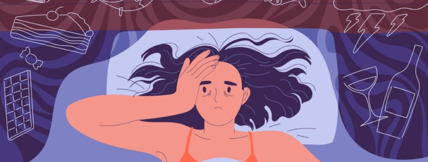
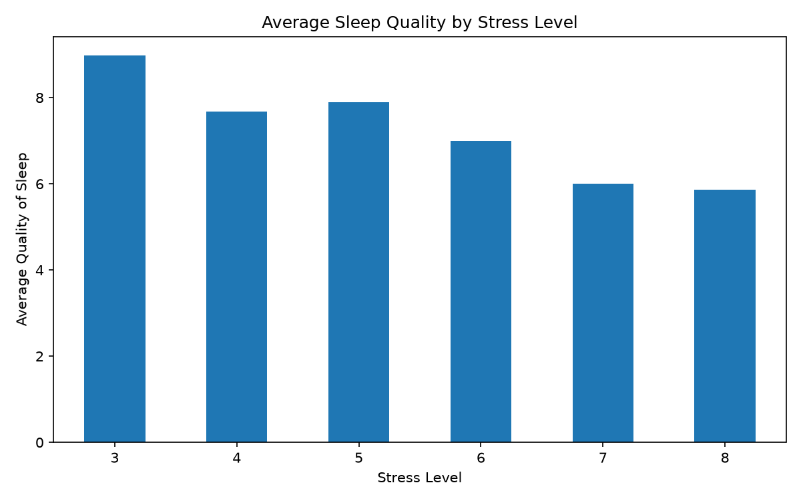
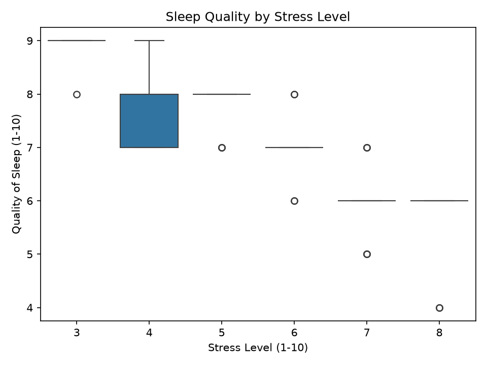
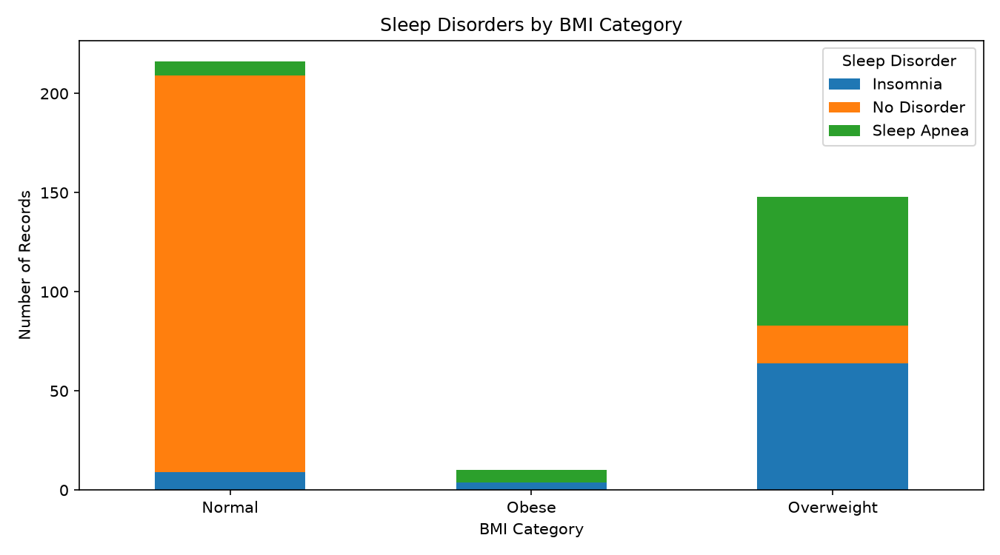

# IDS706 Week 2 Mini-Assignment: Sleep, Stress & Lifestyle Analysis



## Project Goal

For this assignment, I used the Sleep Health and Lifestyle dataset to practice data analysis with Pandas and Polars.

The main question I wanted to explore was:

**Which lifestyle factors line up with sleep quality, and can a simple regression predict it?**

This is Series 1 of the 3-week project. For this week, I focused on understanding and cleaning the dataset, filtering and grouping the data, comparing Pandas and Polars, trying a simple machine learning model, and creating a few visualizations.

---

## Dataset

[Sleep Health and Lifestyle Dataset](https://www.kaggle.com/datasets/uom190346a/sleep-health-and-lifestyle-dataset) from Kaggle.

* 374 rows
* 13 columns in the original file (I add two more during cleaning)
* Synthetic dataset created by the dataset author
* Includes age, gender, occupation, sleep duration, sleep quality, physical activity, stress level, BMI category, blood pressure, heart rate, daily steps, and sleep disorder

The dataset is stored in:

`data/Sleep_health_and_lifestyle_dataset.csv`

---

## Setup

### 1. Clone the repository

```powershell
git clone https://github.com/parvxi/IDS706-Assignment2.git
cd IDS706-Assignment2
```

### 2. Create and activate a virtual environment

```powershell
python -m venv .venv
.venv\Scripts\Activate.ps1
```

### 3. Install the requirements

```powershell
pip install -r requirements.txt
```

### 4. Run the analysis

```powershell
python EDA_Dataset.py
```

The script prints the analysis results in the terminal and saves the plots in the `images/` folder.

---

## Analysis Steps

The Python script is divided into these sections:

1. Load the dataset
2. Inspect the data
3. Clean the data
4. Explore categorical variables
5. Analyze the data using Pandas
6. Repeat the same analysis using Polars
7. Compare Pandas and Polars performance
8. Try a Linear Regression model
9. Create visualizations

---

## Inspecting the Data

I started by using:

* `head()`
* `info()`
* `describe()`
* `nunique()`
* missing value checks
* duplicate checks

The main thing I noticed was the `Sleep Disorder` column.

It had **219 missing values**. In the original dataset, these values represent `"None"`, meaning there is no listed sleep disorder. Pandas reads those values as `NaN`.

I did not want to drop them because that would remove 219 out of 374 records and leave only people with Insomnia or Sleep Apnea.

I also checked duplicates.

There were no fully identical rows because every row has a unique `Person ID`. However, after ignoring `Person ID`, **242 rows repeated an earlier profile**, leaving **132 distinct profiles**.

I kept the repeated profiles for the main analysis, but later I also tested the regression without them.

---

## Cleaning

I made a few cleaning changes before starting the analysis.

### Sleep Disorder

I replaced the missing values with:

```text
No Disorder
```

### BMI Category

The dataset had both:

```text
Normal
Normal Weight
```

Since they represent the same BMI category, I changed `Normal Weight` to `Normal`.

### Blood Pressure

Blood pressure was stored as text, for example:

```text
126/83
```

I split this into two numeric columns:

* `Systolic`
* `Diastolic`

I did this so the values could also be used later as inputs to the regression model.

---

## Pandas Analysis

One of the main relationships I looked at was stress and sleep quality.

### Average Sleep Quality by Stress Level

| Stress Level | Average Sleep Quality |
| ------------ | --------------------: |
| 3            |                  8.97 |
| 4            |                  7.67 |
| 5            |                  7.90 |
| 6            |                  7.00 |
| 7            |                  6.00 |
| 8            |                  5.86 |

There is a general downward pattern in sleep quality as stress increases.

I also compared records with high and low stress.

| Group                     | Records | Avg. Sleep Duration | Avg. Sleep Quality |
| ------------------------- | ------: | ------------------: | -----------------: |
| High stress (7 or higher) |     120 |            6.22 hrs |               5.92 |
| Low stress (4 or lower)   |     141 |            7.63 hrs |               8.33 |

The high-stress group had shorter average sleep duration and lower average sleep quality.

I also filtered the dataset to look at records with less than 6 hours of sleep and compared their age, occupation, sleep quality, and stress level.

### Sleep by BMI Category

| BMI Category | Avg. Sleep | Avg. Quality | Records |
| ------------ | ---------: | -----------: | ------: |
| Normal       |   7.39 hrs |         7.64 |     216 |
| Overweight   |   6.77 hrs |         6.90 |     148 |
| Obese        |   6.96 hrs |         6.40 |      10 |

The Obese group only has 10 records, which is about 7 distinct profiles, so I would not read much into its averages compared with the other two groups.

Because the dataset contains repeated profiles, I also checked the BMI counts using distinct profiles only.

---
## Pandas 🐼 vs. Polars 🐻‍❄️

For the Polars part, I repeated the same main analysis that I did in Pandas:

* average sleep quality by stress level
* high-stress filter
* low-stress filter
* records with less than 6 hours of sleep
* BMI grouping
* distinct profile counts

This made it easier to compare the syntax and performance of the two libraries using the same work.

I timed the analysis over 100 runs because one timing changed a lot on such a small dataset.

My results were approximately:

| Library | Average Time |
| ------- | -----------: |
| Pandas  |     6.223 ms |
| Polars  |     2.184 ms |

Polars was faster in this run.

However, the dataset only has 374 rows, so I would not treat this as a serious benchmark. For me, this part was more useful for comparing how the same analysis is written in Pandas and Polars.

---

## Machine Learning

For the machine learning part, I used **Linear Regression**.

### Target

`Quality of Sleep`

### Features

* Age
* Sleep Duration
* Physical Activity Level
* Stress Level
* Heart Rate
* Daily Steps
* Systolic
* Diastolic

I chose Linear Regression as a simple first model because my target and the features I selected are numeric.

I split the data into 80% training data and 20% testing data.

### Results

| Run                       |   n |  MAE |   R² |
| ------------------------- | --: | ---: | ---: |
| All rows                  | 374 | 0.27 | 0.93 |
| Repeated profiles removed | 132 | 0.29 | 0.90 |

The R² dropped from about **0.93 to 0.90** after removing repeated profiles.

This suggests that the repeated rows are not the main reason the model performs well.

I also checked the correlation between `Stress Level` and `Quality of Sleep`, which was about **-0.90**. This is a strong negative relationship inside this dataset and likely contributes to the strong regression result.

Since this dataset is synthetic, I would be careful about assuming the same results would happen with real-world sleep data.

---

## Visualizations

### Main Plot: Average Sleep Quality by Stress Level



This is my main plot because it directly connects to the question I was exploring.

The overall pattern shows that average sleep quality tends to decrease as stress level increases.

### Sleep Quality by Stress Level



I also used a boxplot to look at the spread of sleep-quality values within each stress level.

This gives more detail than only looking at the averages.

### Sleep Disorders by BMI Category



I used a stacked bar chart to explore how sleep disorder categories are distributed across BMI categories.

This was not my main research question, but it was another relationship in the dataset that I wanted to explore.

---

## Question 2: Rust and Ownership

For the Rust part, I worked through:

`notebooks/rust_vs_python_intro.ipynb`

using the `evcxr_jupyter` Rust kernel.

I completed the exercises and also changed some of the examples myself to see what errors Rust would give me.

| Experiment                                         | What happened                         |
| -------------------------------------------------- | ------------------------------------- |
| Reassigning a regular `let` variable               | Rust gave an immutable variable error |
| Adding `mut` and reassigning                       | Worked                                |
| Moving a vector and then using the original        | Rust gave a moved-value error         |
| Removing `.clone()`                                | Produced the ownership error          |
| Trying to change a vector while looping through it | Rust rejected the code                |
| Borrowing with `&` instead of moving or cloning    | Both names worked, nothing was copied |

The ownership part was probably the biggest difference I noticed compared with Python.

In Python, I normally do not think much about who owns a list or whether a variable is allowed to change. Rust makes those rules much more explicit and will not compile the program if they are broken.

The `.clone()` example also helped me understand that copying data is an actual operation with a cost. Rust makes me ask for that copy explicitly instead of doing it without thinking about it.

The notebook shows borrowing with & but does not have an exercise for it, so I added a cell to try it myself. Both names still worked and nothing was copied, which showed me there is a third option besides moving or cloning.

**Note:** I am still new to Rust, but experimenting with the errors helped the ownership rules make more sense to me than only reading about them.

---

## Repository Structure

```text
IDS706-Assignment2/
│
├── data/
│   └── Sleep_health_and_lifestyle_dataset.csv
│
├── images/
│   ├── stress-image-readme.jpg
│   ├── average_sleep_quality_by_stress.png
│   ├── stress_vs_quality.png
│   └── bmi_vs_sleep_disorder.png
│
├── notebooks/
│   └── rust_vs_python_intro.ipynb
│
├── EDA_Dataset.py
├── requirements.txt
└── README.md
```

---

## Main Takeaways

The clearest pattern I found was the relationship between stress and sleep.

Higher stress levels were associated with shorter sleep duration and lower sleep quality in this dataset.

Polars was faster than Pandas in my small timing comparison, although the dataset is too small to make a strong performance conclusion.

The Linear Regression model also performed well on this dataset. However, because the data is synthetic and contains many repeated profiles, I would treat the model results as an exploration of this dataset rather than assume the same performance would happen with real-world sleep data.
