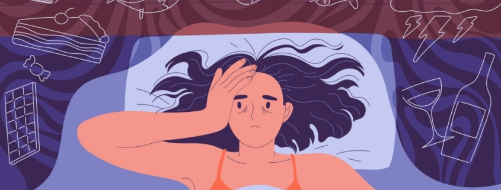
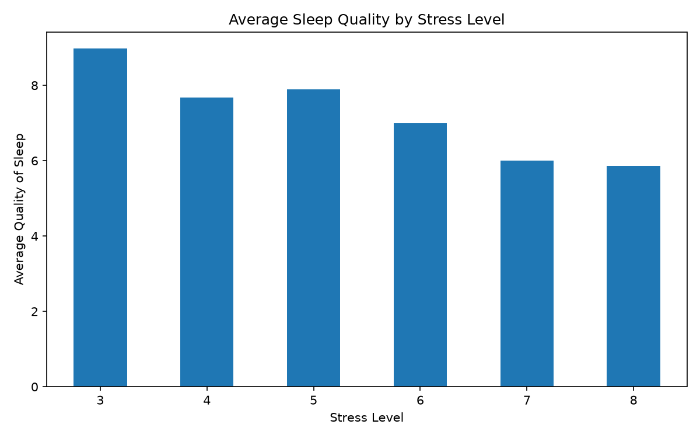
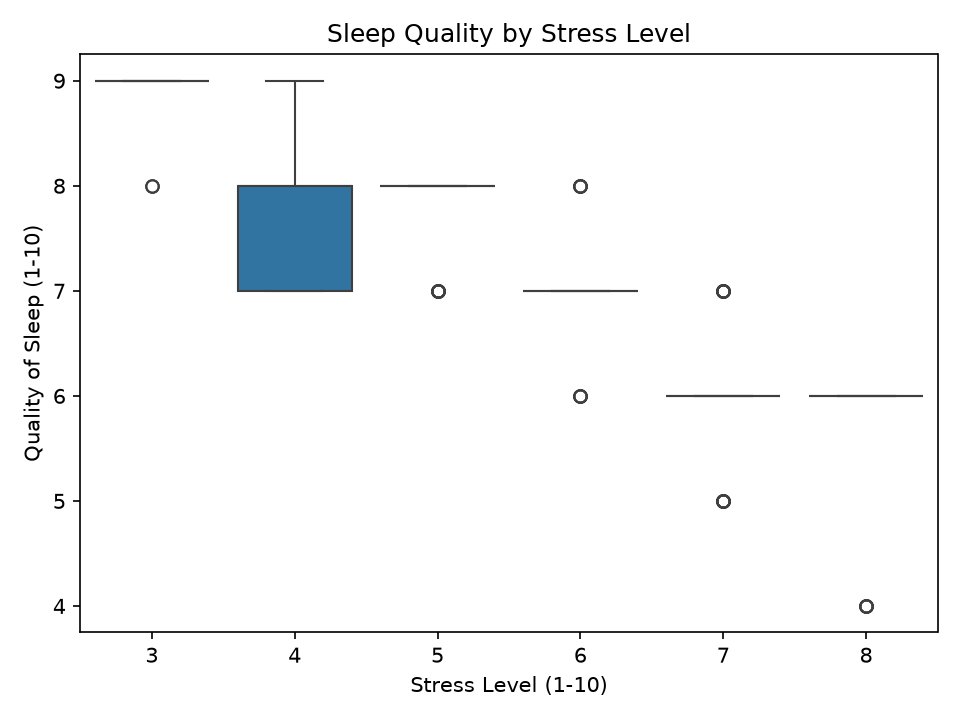
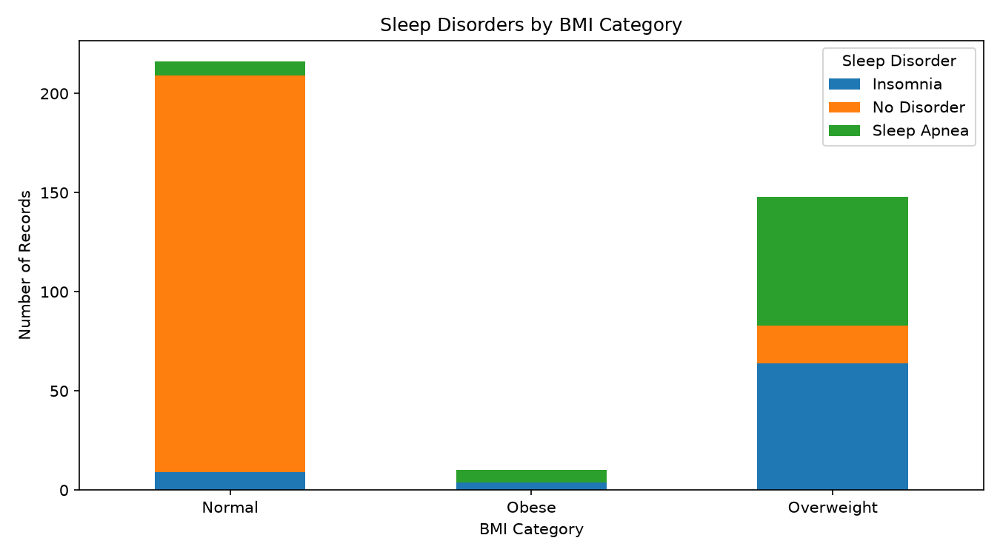
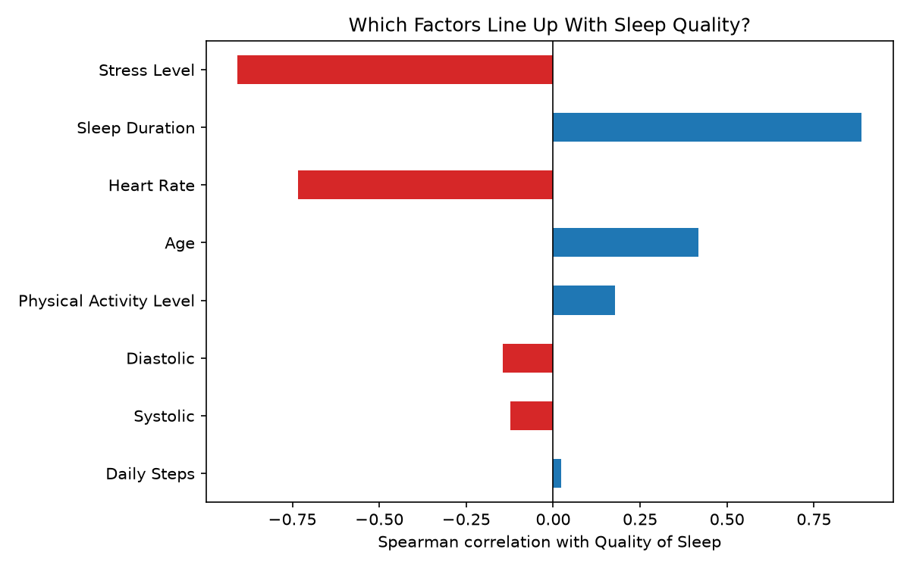
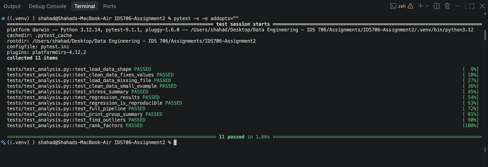
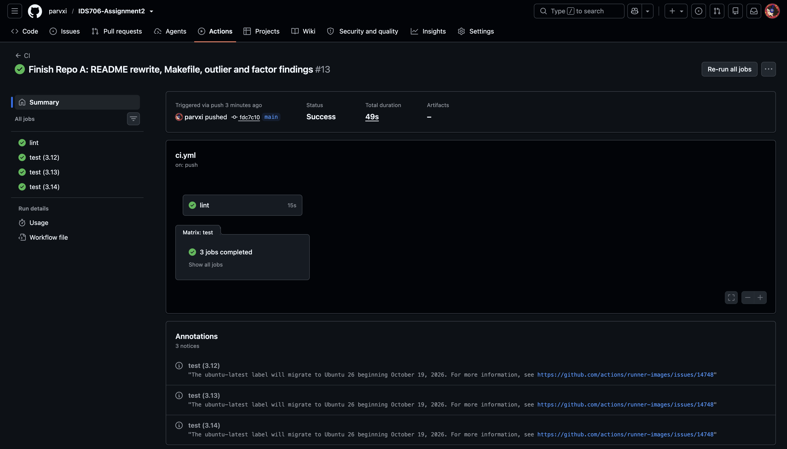
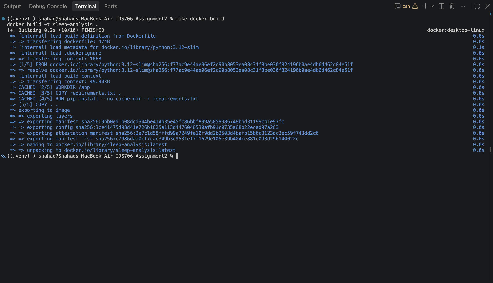
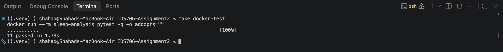
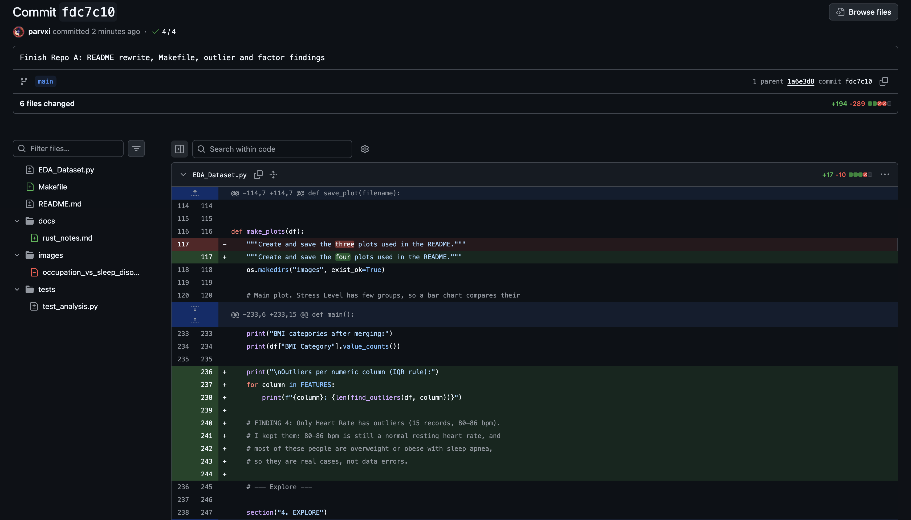

# Sleep, Stress & Lifestyle Analysis

[](https://github.com/parvxi/IDS706-Assignment2/actions/workflows/ci.yml)



## Problem

Poor sleep is common, and it is often blamed on things like stress, long work hours, or not moving enough. I wanted to check which of these everyday factors actually line up with sleep quality in data.

The main question I explored was:

**Which lifestyle factors line up with sleep quality, and can a simple regression predict it?**

This project was built over three weeks: analysis (Week 2), tests and CI (Week 3), and refactoring, Docker, and a deeper look at which factors matter (Week 4).

---

## Key Findings

* **Stress and sleep duration matter most.** Stress Level has a Spearman correlation of **-0.91** with sleep quality, and Sleep Duration **+0.89**. Daily Steps barely matters (**0.02**).
* **High stress means shorter and worse sleep.** People with stress 7 or higher sleep 6.22 hrs on average with quality 5.92. People with stress 4 or lower sleep 7.63 hrs with quality 8.33.
* **A simple Linear Regression predicts sleep quality well** (R² 0.93). It stays high (0.90) even after removing repeated profiles.
* **But the model is not a good way to explain *which* factor matters.** Systolic and Diastolic blood pressure are 0.97 correlated, so the model gives one a big positive weight and the other a big negative weight. That is why I used correlation to answer the "which factors" question (see [My own idea](#my-own-idea-which-factor-matters-most)).

Since the dataset is synthetic and has many repeated profiles, I treat these results as an exploration of this dataset, not as proof about real-world sleep.

---

## Dataset

[Sleep Health and Lifestyle Dataset](https://www.kaggle.com/datasets/uom190346a/sleep-health-and-lifestyle-dataset) from Kaggle, stored in `data/Sleep_health_and_lifestyle_dataset.csv`.

* 374 rows, 13 columns (I add two more during cleaning)
* Synthetic dataset created by the dataset author
* Includes age, gender, occupation, sleep duration, sleep quality, physical activity, stress level, BMI category, blood pressure, heart rate, daily steps, and sleep disorder

---

## Setup

Requires **Python 3.12 or newer**.

```bash
git clone https://github.com/parvxi/IDS706-Assignment2.git
cd IDS706-Assignment2
python3.12 -m venv .venv
source .venv/bin/activate        # Windows: .venv\Scripts\Activate.ps1
pip install -r requirements.txt
```

| Task | Command | Makefile shortcut |
| ---- | ------- | ----------------- |
| Run the analysis | `python EDA_Dataset.py` | `make run` |
| Run the tests | `pytest` | `make test` |
| Format the code | `black EDA_Dataset.py tests/` | `make format` |
| Check formatting and lint | `black --check ...` and `flake8 ...` | `make lint` |

The script prints the results in the terminal and saves the plots in `images/`.

---

## Data Preparation

### Missing values

`Sleep Disorder` had **219 missing values**. In the original file these are `"None"`, meaning no listed sleep disorder, but Pandas reads them as `NaN`. I did not want to drop them because that would remove 219 out of 374 records and leave only people with Insomnia or Sleep Apnea, so I replaced them with `No Disorder`.

### Other cleaning

* `BMI Category` had both `Normal` and `Normal Weight`, so I merged them into `Normal`.
* `Blood Pressure` was stored as text like `126/83`, so I split it into `Systolic` and `Diastolic` to use them in the model.

### Duplicates

There were no fully identical rows because every row has a unique `Person ID`. However, after ignoring `Person ID`, **242 rows repeated an earlier profile**, leaving **132 distinct profiles**. I kept them for the main analysis, but I also ran the regression without them to see how much they affect the results.

### Outliers

I checked every numeric column with the IQR rule (values more than 1.5 × IQR outside the middle 50%). Only **Heart Rate** had outliers: **15 records between 80 and 86 bpm**.

I decided to **keep them**. 80-86 bpm is still a normal resting heart rate (about 60-100), and most of these people are overweight or obese with sleep apnea. They are real cases that fit the topic of this project, not data errors, so removing them would hide a real pattern.

---

## Analysis

### Stress and sleep

| Stress Level | Average Sleep Quality |
| ------------ | --------------------: |
| 3            |                  8.97 |
| 4            |                  7.67 |
| 5            |                  7.90 |
| 6            |                  7.00 |
| 7            |                  6.00 |
| 8            |                  5.86 |



There is a general downward pattern in sleep quality as stress increases. I also used a boxplot to see the spread within each stress level, which gives more detail than only looking at the averages:



### Sleep by BMI category

| BMI Category | Avg. Sleep | Avg. Quality | Records |
| ------------ | ---------: | -----------: | ------: |
| Normal       |   7.39 hrs |         7.64 |     216 |
| Overweight   |   6.77 hrs |         6.90 |     148 |
| Obese        |   6.96 hrs |         6.40 |      10 |

The Obese group only has 10 records (about 7 distinct profiles), so I would not read much into its averages.



### Pandas 🐼 vs. Polars 🐻‍❄️

I repeated the same analysis in Polars and timed both over 100 runs. On my Mac, Polars was faster (about 0.6 ms vs 1.0 ms). Inside the Docker container, Pandas was faster (about 1.1 ms vs 2.9 ms). The analysis results were exactly the same in both places, only the speed changed. With 374 rows this is not a real benchmark, but it showed me that timing depends on the environment while the results stay reproducible.

### Machine learning

I used **Linear Regression** to predict `Quality of Sleep` from Age, Sleep Duration, Physical Activity Level, Stress Level, Heart Rate, Daily Steps, Systolic, and Diastolic, with an 80/20 train/test split.

| Run                       |   n |  MAE |   R² |
| ------------------------- | --: | ---: | ---: |
| All rows                  | 374 | 0.27 | 0.93 |
| Repeated profiles removed | 132 | 0.29 | 0.90 |

The R² only dropped from 0.93 to 0.90 after removing repeated profiles, so the repeated rows are not the main reason the model performs well.

### My own idea: which factor matters most?

My question asks *which* lifestyle factors line up with sleep quality, but the regression only showed that the factors *together* predict it well. So I ranked each factor by its correlation with sleep quality.



Red means more of this factor goes with worse sleep, blue means better sleep.

Two decisions I made here:

* **Spearman instead of Pearson.** Sleep quality and stress are 1-10 ratings, not exact measurements, and Spearman is better suited for ranked data like this. The ranking was the same with both methods.
* **Correlation instead of the model's coefficients.** I first tried using the regression weights, but blood pressure suddenly looked like the most important factor. Systolic and Diastolic are 0.97 correlated with each other, so the model splits their effect into a large positive and a large negative weight that cancel out (multicollinearity). The same happens with Heart Rate, which moves together with stress. The model still predicts well, but its weights are misleading as an explanation.

---

## Testing

The analysis is split into small functions so each part can be tested on its own. There are **11 tests** in `tests/test_analysis.py`:

| Area | What I check |
| ---- | ------------ |
| Loading | 374 rows and 13 columns; a missing file raises `FileNotFoundError` |
| Cleaning | no missing values left, `Normal Weight` merged, blood pressure split correctly on a tiny hand-made table, the original data is not changed |
| Analysis | stress averages match the table above, group summary prints the right numbers, IQR finds exactly one outlier in a small example, factors are ranked strongest first |
| Model | R² and MAE are valid, predictions have the right length, the same `random_state` gives the same result |
| Full pipeline (system test) | `main()` runs from start to finish and re-creates all four plots |



---

## Continuous Integration

The GitHub Actions workflow (`.github/workflows/ci.yml`) has two jobs:

* **lint**: checks formatting with `black` and style with `flake8`
* **test**: runs `pytest` on **Python 3.12, 3.13, and 3.14** using a matrix

It runs on every push and pull request, **every Monday** on a schedule (to catch problems when a library updates), and can also be started by hand. I pinned the runner to `ubuntu-24.04` instead of `ubuntu-latest` so the environment does not change without me noticing.

<!-- TODO: add screenshot of the Actions run with all 4 green jobs -->


---

## Docker

```bash
docker build -t sleep-analysis .                                  # build the image
docker run --rm sleep-analysis                                    # run the analysis
docker run --rm -v "$(pwd)/images:/app/images" sleep-analysis     # also save the plots to my computer
docker run --rm sleep-analysis pytest -q -o addopts=""            # run the tests inside the container
```

What I learned:

* **Copying `requirements.txt` before the code** lets Docker reuse the slow install step. When I only change my code, a rebuild takes about a second instead of 25.
* **`.dockerignore` matters.** Without it, Docker would copy my whole `.venv` into the build. With it, the build context was only 76 kB.
* **Containers are isolated.** The plots were saved inside the container and disappeared with it, until I connected my `images/` folder with a volume (`-v`).

<!-- TODO: add screenshots of the build and of the container running -->




---

## Refactoring and Code Quality

| What I changed | Why |
| -------------- | --- |
| Renamed `CSV` to `DATA_PATH` (with F2) | the name described the file type, not what it is |
| Replaced the numbers `7`, `4`, `6` with `HIGH_STRESS`, `LOW_STRESS`, `SHORT_SLEEP_HOURS` | the same numbers were repeated in 12 places with no explanation |
| Extracted `print_group_summary()` | the same 3 print lines were copied 4 times for Pandas and Polars |
| Extracted `make_plots()` and `save_plot()` out of `main()` | `main()` was about 250 lines, and every plot repeated the same 3 save lines |
| Moved `os.makedirs` into `make_plots()` | it ran every time a test only imported the file |
| Formatted with `black` and fixed `flake8` issues | black already had nothing to change; flake8 found 23 issues, mostly because black allows 88 characters and flake8 79, so I added a `.flake8` config and split the 5 lines that were really too long by hand |

**How I verified it still works:** after each change I ran the tests, `black --check`, and `flake8`, and compared the output with the numbers above (120 / 141 records, R² 0.93 / 0.90). I also added a test for the new `print_group_summary()` function. Each refactoring step is its own commit, so it can be checked in the history.

<!-- TODO: add screenshot of the "Extract print_group_summary" commit diff on GitHub -->


Things I would still improve: the timing code in section 7 is written twice, and `main()` could be split further into one function per section.

---

## Repository Structure

```text
IDS706-Assignment2/
├── .github/workflows/ci.yml    # CI: lint + tests on 3 Python versions
├── data/                       # dataset
├── docs/rust_notes.md          # Week 2 Rust exercise notes
├── images/                     # plots and screenshots
├── notebooks/                  # Week 2 Rust notebook
├── tests/test_analysis.py      # 11 tests
├── EDA_Dataset.py              # the analysis
├── Dockerfile, .dockerignore   # container setup
├── Makefile                    # shortcuts for run / test / lint / docker
├── .flake8, pytest.ini         # tool settings
└── requirements.txt            # pinned dependencies
```

---

## Main Takeaways

The clearest pattern I found was the relationship between stress and sleep: higher stress goes with shorter and worse sleep, and stress and sleep duration line up with sleep quality more than anything else in this dataset.

The regression predicted sleep quality well, but working on the factor ranking taught me that a model can predict well and still be misleading about *why*.

Over the three weeks, the project also became much easier to trust: the tests, CI on three Python versions, and Docker all show that anyone can get the same results I did.

The Week 2 Rust exercise notes are in [docs/rust_notes.md](docs/rust_notes.md).
